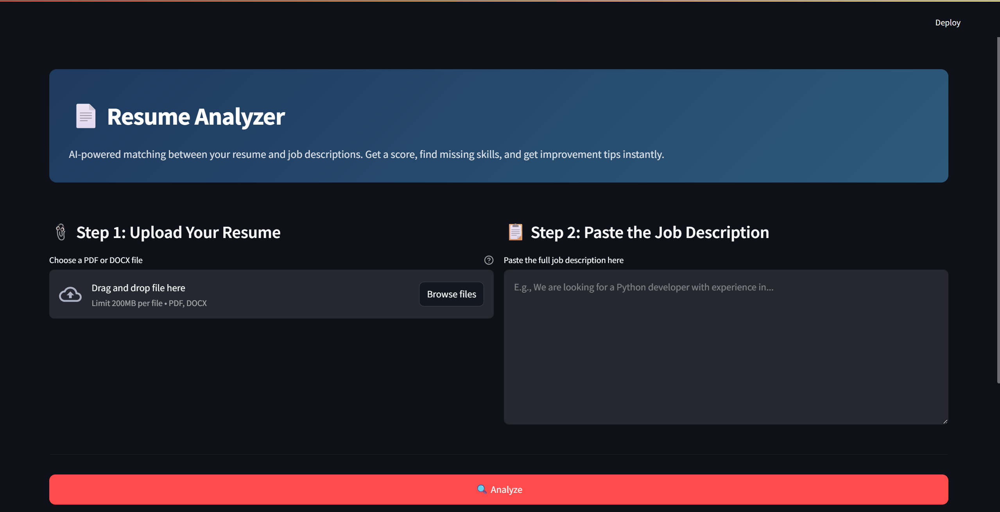
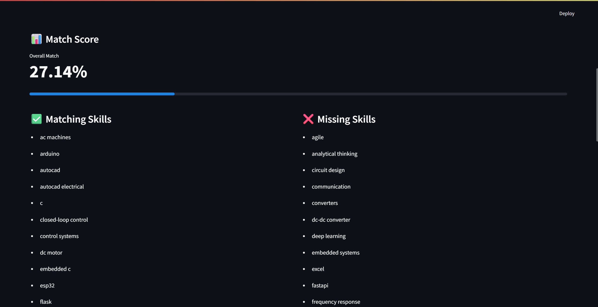
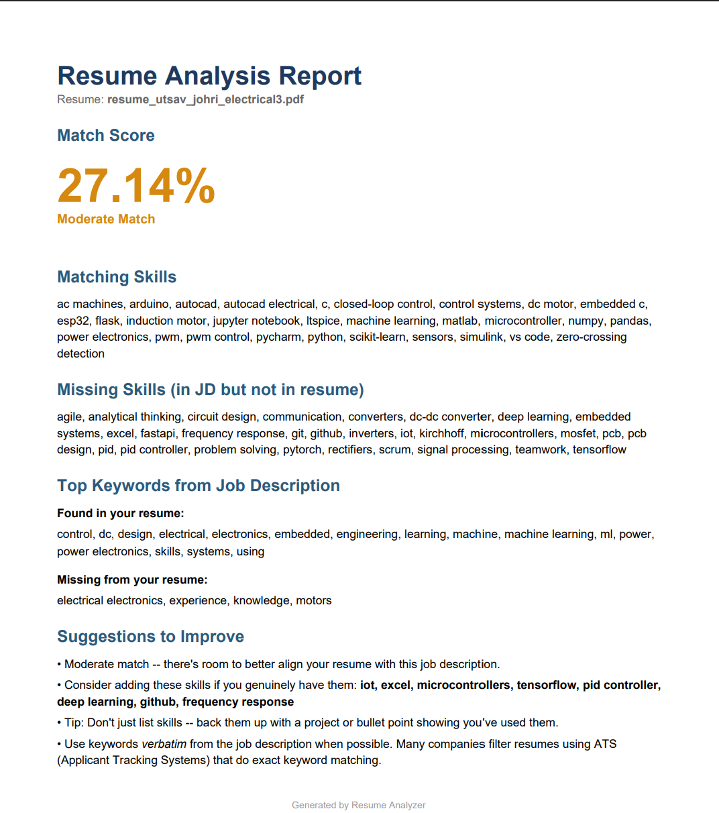

# 📄 Resume Analyzer

> AI-powered tool that analyzes your resume against any job description and gives you a match score, missing keywords, and improvement tips.

🔗 **[Live Demo](#)** *(URL will be added after deployment)*

---

## ✨ Features

- **📊 Match Score (0–100)** — uses TF-IDF vectorization and cosine similarity to compute how well your resume aligns with a job description
- **🎯 Skill Gap Analysis** — identifies matching and missing skills from a curated database of 170+ technical and soft skills
- **🔑 Keyword Extraction** — pulls top keywords from the JD using TF-IDF and shows what's in/missing from your resume
- **📥 Downloadable Reports** — export results as a styled PDF or plain TXT
- **📄 Multi-format Support** — accepts both PDF and DOCX resumes
- **🌗 Domain-flexible** — works for both software/tech and electrical/electronics roles

---

## 🧠 How It Works

1. **Text Extraction** — pdfplumber extracts text from PDFs (better than PyPDF2 for complex layouts); python-docx handles Word documents
2. **Preprocessing** — lowercasing, whitespace normalization, smart character handling
3. **Skill Matching** — two-pass detection: word-boundary matching + compact matching for PDF-extraction edge cases
4. **TF-IDF Vectorization** — converts both documents into numerical vectors that capture word importance
5. **Cosine Similarity** — measures the angle between vectors to produce a match score (0–100%)
6. **Report Generation** — assembles findings into both human-readable text and styled PDF formats using ReportLab

---

## 🛠️ Tech Stack

| Component | Technology |
|-----------|-----------|
| Frontend | Streamlit |
| NLP | spaCy, scikit-learn (TF-IDF) |
| PDF Extraction | pdfplumber |
| DOCX Extraction | python-docx |
| PDF Generation | ReportLab |
| Data | pandas, NumPy |

---

## 🚀 Run Locally

Clone the repo:

    git clone https://github.com/Sav04/resume-analyzer.git
    cd resume-analyzer

Create and activate a virtual environment (Windows):

    python -m venv venv
    venv\Scripts\Activate.ps1

On Mac or Linux:

    python -m venv venv
    source venv/bin/activate

Install dependencies:

    pip install -r requirements.txt
    python -m spacy download en_core_web_sm

Run the app:

    streamlit run app.py

Then open http://localhost:8501 in your browser.

---

## 📸 Screenshots

### Home — Upload your resume and paste a job description

### Results — Match score, matching/missing skills, and keyword analysis

### Downloadable PDF Report

---

## 🔮 Future Improvements

- [ ] OCR support for scanned PDFs (using Tesseract)
- [ ] LLM-powered rewrite suggestions (Gemini or Claude API)
- [ ] Multi-JD comparison (paste 3 JDs, see which matches best)
- [ ] Custom skill databases per industry
- [ ] User accounts to save analysis history

---

## 📚 What I Learned

- Building a real-world NLP pipeline (extraction → cleaning → vectorization → similarity)
- Handling messy real-world data (LaTeX-PDF extraction quirks)
- Designing for multiple file formats and gracefully degrading on errors
- Generating styled PDFs programmatically with ReportLab
- Deploying ML apps to production via Streamlit Community Cloud

---

## 👤 Author

Built by **Utsav Johri** — Electrical & Electronics Engineering student exploring AI/ML and software engineering.

📫 johriutsav@gmail.com  
🔗 [GitHub](https://github.com/Sav04)

---

## 📝 License

MIT License — feel free to use, modify, and learn from this code.